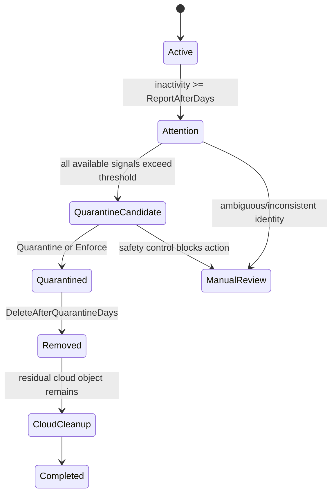

# DeviceLifecycle

[English](README.md) | [Português](README.pt-BR.md)

[](LICENSE)

PowerShell automation for safely managing the lifecycle of Windows devices across Active Directory, Microsoft Entra ID, and Microsoft Intune.

> **Current status:** production-validated with `ReportOnly`, `Enforce -WhatIf`, and a controlled real `Enforce` run.

## Overview

Windows devices can remain registered in Active Directory, Entra ID, and Intune long after they stop being used. Those records do not always exist or update at the same time, so a safe lifecycle policy cannot rely only on computer names or require every management source to be present.

DeviceLifecycle treats Active Directory as the authoritative on-premises source, correlates cloud records when they exist, and evaluates only activity signals that are actually available and trustworthy.

The workflow provides three operating modes:

- `ReportOnly`: inventories and classifies devices without administrative changes;
- `Quarantine`: performs reversible containment while preserving lifecycle state;
- `Enforce`: includes quarantine and permits final removal after configured retention periods.

## Current correlation policy

The decision model explicitly distinguishes a **missing source record** from an **inconsistent source record**.

1. The Active Directory object is always required and its activity timestamp is mandatory.
2. If exactly one matching Entra ID device exists, it participates in the decision and must provide a valid activity timestamp.
3. If exactly one matching Intune managed-device record exists, it also participates in the decision and must provide a valid activity timestamp.
4. If no Entra ID or Intune record exists, that source is treated as unavailable evidence and does not block lifecycle evaluation.
5. Multiple matches, identity inconsistency, or a missing timestamp on a source that does exist result in `ManualReview`.
6. A Microsoft Graph query failure is different from a successful query returning zero records and keeps the workflow fail-closed.

Examples:

| Available evidence | Evaluation behavior |
|---|---|
| Old AD; no Entra; no Intune | Uses AD only |
| Old AD; old Entra; no Intune | Uses AD + Entra |
| Old AD; old Entra; old Intune | Uses all three sources |
| Old AD; recent Entra | Remains active |
| Old AD; recent Intune | Remains active |
| Existing source without a reliable timestamp | `ManualReview` |
| Duplicate or inconsistent match | `ManualReview` |

This prevents stale AD computers from remaining indefinitely in manual review solely because a cloud record no longer exists, while preserving strict validation for sources that are present.

## Lifecycle



Current defaults:

| Stage | Default |
|---|---:|
| Attention report | 75 inactive days |
| Quarantine candidate | 90 inactive days |
| Final deletion | 30 additional quarantine days |
| Residual Entra cleanup | 7 days after AD deletion |

## Scheduled execution model

The installer registers **two separate scheduled tasks**.

### `{OrganizationName} - Device Lifecycle`

Primary lifecycle task.

- runs daily at the time configured in `TaskTime`;
- uses the configured `Mode` (`ReportOnly`, `Quarantine`, or `Enforce`);
- may modify AD, Intune, and Entra according to lifecycle stage and safety controls;
- runs as `NT AUTHORITY\SYSTEM`.

### `{OrganizationName} - Device Lifecycle Snapshot`

Observability and inventory task.

- runs at the interval configured by `SnapshotIntervalMinutes`;
- defaults to 30 minutes;
- always forces `-ModeOverride ReportOnly` regardless of the primary operational mode;
- keeps `DeviceLifecycle-Latest.csv` current for audits, dashboards, and integrations;
- never performs lifecycle changes.

Both tasks use `Invoke-DeviceLifecycleLocked.ps1` to prevent concurrent runs of the same process.

## Safety model

The project keeps explicit safety controls around every destructive path:

- `ReportOnly` remains the default deployment mode;
- a missing cloud record is not treated as an identity inconsistency;
- duplicate, ambiguous, or incompatible matches remain in `ManualReview`;
- missing timestamps on existing sources remain in `ManualReview`;
- protected objects and configured exclusions are not changed;
- `MaximumActionsPerRun` limits operational blast radius per execution;
- destructive paths support PowerShell `-WhatIf`;
- final deletion occurs only after the quarantine window;
- residual Entra cleanup occurs only after the AD object has been deleted;
- persistent state allows lifecycle processing to continue after Intune `Retire` removes the managed-device record.

See [SECURITY.md](SECURITY.md) and [Architecture](docs/en/ARCHITECTURE.md).

## Requirements

- Windows Server with Windows PowerShell 5.1;
- Active Directory PowerShell module;
- Microsoft Graph PowerShell modules used by the project;
- Microsoft Entra App Registration using certificate authentication;
- delegated administrative permissions limited to the required scope;
- quarantine OU kept inside Microsoft Entra Connect synchronization scope when Hybrid Join is used.

Microsoft Graph application permissions used by the project:

- `Device.ReadWrite.All`
- `DeviceManagementManagedDevices.ReadWrite.All`
- `DeviceManagementManagedDevices.PrivilegedOperations.All`
- `DeviceManagementServiceConfig.Read.All`

## Quick start

### 1. Configure

Edit `DeviceLifecycle.Config.psd1`:

```powershell
OrganizationName = 'orgname'
Mode = 'ReportOnly'

TenantId = 'YOUR-TENANT-ID'
ClientId = 'YOUR-CLIENT-ID'
CertificateThumbprint = 'LOCAL-MACHINE-CERTIFICATE-THUMBPRINT'
```

### 2. Initialize

```powershell
.\Initialize-DeviceLifecycle.ps1 `
    -InstallModules `
    -CreateAdObjects `
    -CreateCertificate
```

### 3. Validate the environment

```powershell
.\Test-DeviceLifecycle.ps1
```

### 4. Run the initial inventory

```powershell
.\Invoke-DeviceLifecycle.ps1 -ModeOverride ReportOnly
```

Review at least:

- `ManualReview`
- `AmbiguousEntraMatch`
- `AmbiguousIntuneMatch`
- `MissingActivityTimestamp`
- `Warning`
- `QuarantineCandidate`

### 5. Install scheduled tasks

```powershell
.\Install-DeviceLifecycleTask.ps1
```

On an existing installation, the installer preserves the operational configuration by default. Use `-ForceConfig` only when you intentionally want to replace the installed configuration with the supplied template.

## Enabling Enforce

The recommended sequence before production is:

```powershell
.\Invoke-DeviceLifecycle.ps1 -ModeOverride ReportOnly
.\Invoke-DeviceLifecycle.ps1 -ModeOverride Enforce -WhatIf
.\Invoke-DeviceLifecycle.ps1 -ModeOverride Enforce
```

After reviewing the first changed batch and confirming expected behavior, configure:

```powershell
Mode = 'Enforce'
```

The primary task then runs the full lifecycle on its configured schedule, while the snapshot task remains isolated in `ReportOnly`.

### Production validation

On August 28, 2026, the optional Entra ID/Intune correlation policy was validated in a real environment. The `ReportOnly` snapshot correctly classified stale devices without cloud records as lifecycle candidates, `Enforce -WhatIf` showed only the expected changes, and the first controlled `Enforce` execution successfully quarantined the permitted batch without requiring Entra ID or Intune records to exist.

Environment-specific device counts and identifiers are intentionally not stored in the public repository.

## Recovery

Preview:

```powershell
.\Restore-QuarantinedDevice.ps1 -ComputerName DEVICE-NAME -WhatIf
```

Execute:

```powershell
.\Restore-QuarantinedDevice.ps1 -ComputerName DEVICE-NAME
```

A completed Intune `Retire` may require the device to be enrolled again after restoration.

## DeviceLifecycle-API

[DeviceLifecycle-API](https://github.com/diogowermann/DeviceLifecycle-API) is a separate, optional, read-only extension. It publishes reports and logs produced by DeviceLifecycle to authorized consumers and does not provide quarantine, deletion, or restore endpoints.

## Main project structure

```text
DeviceLifecycle/
|-- CHANGELOG.md
|-- DeviceLifecycle.Config.psd1
|-- DeviceLifecycle.Helpers.psm1
|-- Initialize-DeviceLifecycle.ps1
|-- Install-DeviceLifecycleTask.ps1
|-- Invoke-DeviceLifecycle.ps1
|-- Invoke-DeviceLifecycleLocked.ps1
|-- Restore-QuarantinedDevice.ps1
|-- Test-DeviceLifecycle.ps1
|-- Uninstall-DeviceLifecycle.ps1
|-- SECURITY.md
|-- tests/
|   `-- Test-ActivityCorrelationPolicy.ps1
|-- docs/
|   |-- en/ARCHITECTURE.md
|   `-- pt-BR/ARCHITECTURE.md
|-- README.md
`-- README.pt-BR.md
```

## Documentation

- [Architecture and engineering decisions](docs/en/ARCHITECTURE.md)
- [Security policy](SECURITY.md)
- [Changelog](CHANGELOG.md)
- [Documentação em português](README.pt-BR.md)
- [DeviceLifecycle-API](https://github.com/diogowermann/DeviceLifecycle-API)

## License

DeviceLifecycle is distributed under the [MIT License](LICENSE).

## Author

Developed by [Diogo Wermann](https://github.com/diogowermann) as part of a Windows endpoint management, identity, and automation portfolio.
