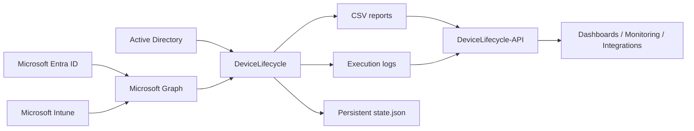
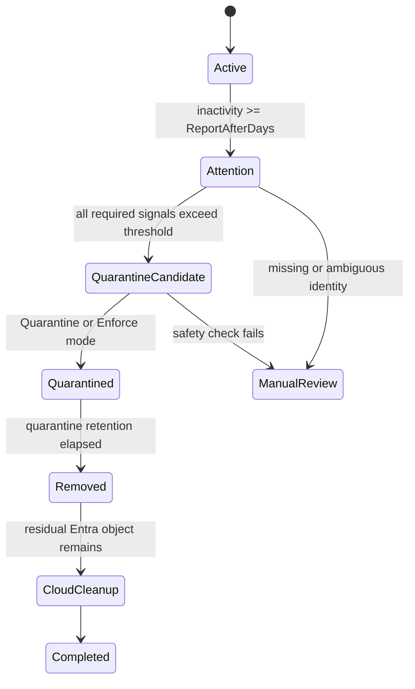

# DeviceLifecycle

[English](README.md) | [Português](README.pt-BR.md)

[](LICENSE)

PowerShell automation for safely managing inactive hybrid Windows devices across Active Directory, Microsoft Entra ID, and Microsoft Intune.

> **Portfolio note:** this project was designed around conservative identity correlation, staged enforcement, recoverability, and least-privilege administration.

<!-- IMAGE PLACEHOLDER: Add a sanitized screenshot of the DeviceLifecycle report or execution summary here. Suggested path: docs/assets/device-lifecycle-overview.png -->

## Disclaimer

This project was originally designed for real-world enterprise environments. All organization-specific information, credentials, tenant identifiers, hostnames, IP addresses, certificate references, and other sensitive values must be removed or replaced before publication.

The repository is provided as a technical reference and starting point, not as a substitute for environment-specific validation. Test the complete workflow in `ReportOnly` mode and within a controlled pilot scope before enabling any action that changes or removes device identities.

## Overview

Hybrid Windows devices may remain registered in Active Directory, Microsoft Entra ID, and Microsoft Intune long after they stop being used. Removing them manually is time-consuming and risky because device identities and activity timestamps may differ between platforms.

DeviceLifecycle correlates device records across the three systems, evaluates multiple activity signals, and moves devices through a controlled lifecycle:

1. reporting;
2. quarantine;
3. final removal;
4. residual cloud cleanup.

Ambiguous, incomplete, duplicated, or unsafe records are sent to manual review and are not changed automatically.

## Key Features

- Correlates AD, Entra ID, and Intune records using stable identifiers rather than computer names alone.
- Uses staged modes: `ReportOnly`, `Quarantine`, and `Enforce`.
- Preserves operational state after an Intune `Retire` removes the managed-device record.
- Excludes servers, domain controllers, Autopilot devices, protected objects, and configured exceptions.
- Applies a configurable hard limit to the number of devices changed per run.
- Generates CSV reports and execution logs.
- Supports `-WhatIf` for safe simulation.
- Can trigger Microsoft Entra Connect delta synchronization after changes.
- Provides a recovery script for quarantined devices.
- Offers an optional read-only HTTP extension through [DeviceLifecycle-API](https://github.com/diogowermann/DeviceLifecycle-API).

## Architecture



Device identity correlation follows this chain:


<!-- IMAGE PLACEHOLDER: Add a sanitized architecture diagram or execution flow screenshot here. Suggested path: docs/assets/architecture.png -->

See [Architecture](docs/en/ARCHITECTURE.md) for the lifecycle, trust boundaries, and design decisions.

## Lifecycle



Default thresholds are configurable. The repository currently ships with:

| Stage | Default |
|---|---:|
| Attention report | 75 inactive days |
| Quarantine candidate | 90 inactive days |
| Final deletion | 30 additional quarantine days |
| Residual Entra cleanup | 7 days after AD deletion |

## Safety Model

DeviceLifecycle is intentionally conservative:

- `ReportOnly` is the default mode.
- Missing, duplicated, or ambiguous cloud matches are not modified.
- Empty or unreliable activity timestamps are sent to `ManualReview`.
- The execution server, Windows Server devices, domain controllers, Autopilot devices, and group exclusions are protected.
- The quarantine OU must remain inside Microsoft Entra Connect synchronization scope.
- Final Entra cleanup happens only after the AD object has been deleted.
- `MaximumActionsPerRun` provides a hard operational brake.
- Destructive workflows can be simulated with `-WhatIf`.

> **Important:** removing the quarantine OU from Entra Connect scope can remove devices from Entra ID immediately and bypass the intended grace period.

See [SECURITY.md](SECURITY.md) for vulnerability reporting and deployment-security requirements.

## Requirements

- Windows Server hosting Microsoft Entra Connect Sync.
- Windows PowerShell 5.1.
- Active Directory PowerShell module.
- Microsoft Graph PowerShell modules used by the project.
- Permission to create and manage the configured quarantine OU and exclusion group.
- Microsoft Entra App Registration using certificate authentication.
- Required Microsoft Graph application permissions:
  - `Device.ReadWrite.All`
  - `DeviceManagementManagedDevices.ReadWrite.All`
  - `DeviceManagementManagedDevices.PrivilegedOperations.All`
  - `DeviceManagementServiceConfig.Read.All`

## Quick Start

### 1. Configure the organization

Edit `DeviceLifecycle.Config.psd1`:

```powershell
OrganizationName = 'orgname'
Mode = 'ReportOnly'

TenantId = 'YOUR-TENANT-ID'
ClientId = 'YOUR-CLIENT-ID'
CertificateThumbprint = 'LOCAL-MACHINE-CERTIFICATE-THUMBPRINT'
```

`OrganizationName` is used to derive installation paths, task names, and certificate identifiers.

### 2. Initialize dependencies and AD objects

Run PowerShell as administrator:

```powershell
Set-ExecutionPolicy Bypass -Scope Process -Force

.\Initialize-DeviceLifecycle.ps1 `
    -InstallModules `
    -CreateAdObjects `
    -CreateCertificate
```

Upload the generated public certificate to the Microsoft Entra App Registration and copy the thumbprint into the configuration file.

### 3. Validate the environment

```powershell
.\Test-DeviceLifecycle.ps1
```

All required checks should return `True` before enforcement is enabled.

### 4. Run the first inventory

```powershell
.\Invoke-DeviceLifecycle.ps1
```

Reports and logs are written under:

```text
C:\ProgramData\{OrganizationName}\DeviceLifecycle\
|-- Reports\
|-- Logs\
`-- state.json
```

Review at least these outcomes:

- `ManualReview`
- `MissingEntraMatch`
- `MissingIntuneMatch`
- `AmbiguousEntraMatch`
- `AmbiguousIntuneMatch`
- `MissingActivityTimestamp`
- `QuarantineCandidate`

<!-- IMAGE PLACEHOLDER: Add a sanitized CSV report screenshot showing the review/result columns here. Suggested path: docs/assets/report-example.png -->

### 5. Install the scheduled task

```powershell
.\Install-DeviceLifecycleTask.ps1 -ForceConfig
```

The default execution time is `02:15`.

## Recommended Rollout

### Phase 1 — Report only

Keep the automation in this mode for at least two weeks:

```powershell
Mode = 'ReportOnly'
```

### Phase 2 — Quarantine

After validating candidates and recovery procedures:

```powershell
Mode = 'Quarantine'
```

This mode retires the Intune device, disables the AD computer account, and moves it to the quarantine OU. It does not perform final deletion.

### Phase 3 — Enforce

After testing recovery and confirming BitLocker recovery-key availability:

```powershell
Mode = 'Enforce'
```

## Recovery

Preview recovery:

```powershell
.\Restore-QuarantinedDevice.ps1 -ComputerName DEVICE-NAME -WhatIf
```

Execute recovery:

```powershell
.\Restore-QuarantinedDevice.ps1 -ComputerName DEVICE-NAME
```

A completed Intune `Retire` may require the device to be enrolled again after restoration.

## Simulation

```powershell
.\Invoke-DeviceLifecycle.ps1 -ModeOverride Enforce -WhatIf
```

## Uninstallation

Preview the complete removal:

```powershell
.\Uninstall-DeviceLifecycle.ps1 -WhatIf
```

Interactive removal:

```powershell
.\Uninstall-DeviceLifecycle.ps1
```

Non-interactive removal:

```powershell
.\Uninstall-DeviceLifecycle.ps1 -Force
```

Back up reports and logs before uninstalling. The installation directory and its operational history may be removed permanently.

## Optional API Extension

[DeviceLifecycle-API](https://github.com/diogowermann/DeviceLifecycle-API) is a separate, optional, read-only extension that publishes the latest CSV report and log through authenticated HTTP endpoints.

The API does not execute lifecycle actions and is not required for DeviceLifecycle to operate. The main service remains the authoritative producer of reports, logs, and state.

## Project Structure

```text
DeviceLifecycle/
|-- CHANGELOG.md
|-- DeviceLifecycle.Config.psd1
|-- DeviceLifecycle.Helpers.psm1
|-- Initialize-DeviceLifecycle.ps1
|-- Install-DeviceLifecycleTask.ps1
|-- Invoke-DeviceLifecycle.ps1
|-- LICENSE
|-- Restore-QuarantinedDevice.ps1
|-- SECURITY.md
|-- Test-DeviceLifecycle.ps1
|-- Uninstall-DeviceLifecycle.ps1
|-- docs/
|   |-- en/
|   |   `-- ARCHITECTURE.md
|   |-- pt-BR/
|   |   `-- ARCHITECTURE.md
|   `-- assets/
|-- README.md
`-- README.pt-BR.md
```

## Documentation

- [Architecture and engineering decisions](docs/en/ARCHITECTURE.md)
- [Security policy](SECURITY.md)
- [Changelog](CHANGELOG.md)
- [MIT License](LICENSE)
- [Documentação em português](README.pt-BR.md)
- [DeviceLifecycle-API](https://github.com/diogowermann/DeviceLifecycle-API)

## Planned Portfolio Assets

The following placeholders are intentionally left in the documentation for sanitized screenshots:

- execution/report overview;
- architecture or lifecycle illustration;
- sanitized CSV report example.

Search this repository for `IMAGE PLACEHOLDER` to locate every insertion point.

## License

DeviceLifecycle is licensed under the [MIT License](LICENSE). You may use, copy, modify, merge, publish, distribute, sublicense, and sell copies of the software under the license terms. The software is provided without warranty.

## Author

Developed by [Diogo Wermann](https://github.com/diogowermann) as part of a Windows endpoint management, identity, and automation portfolio.
