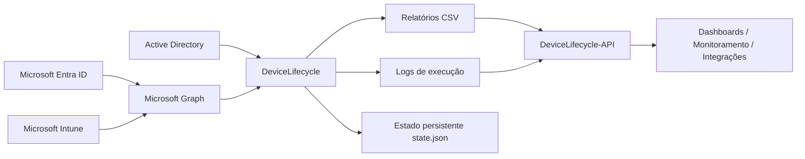
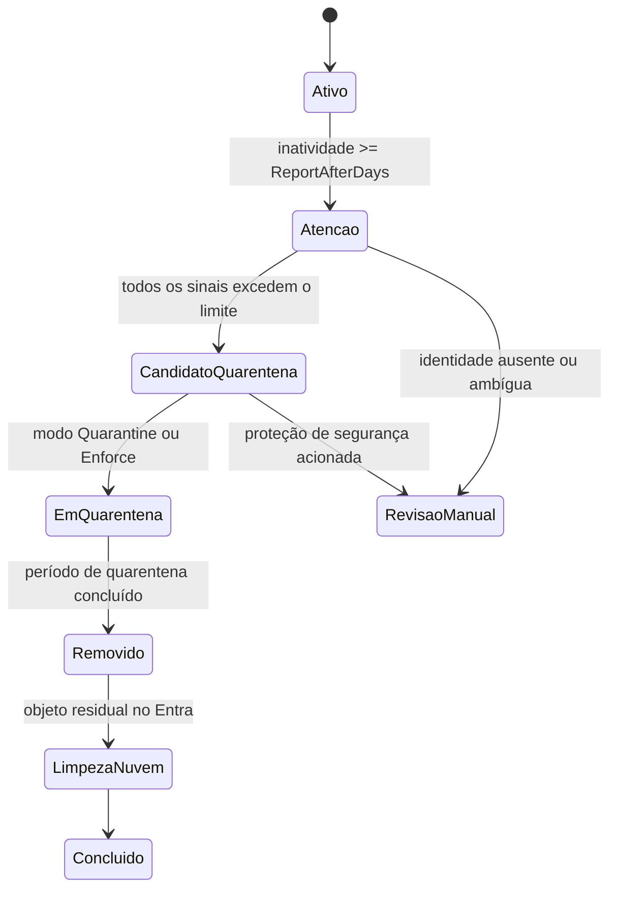

# DeviceLifecycle

[English](README.md) | [Português](README.pt-BR.md)

Automação em PowerShell para gerenciar com segurança o ciclo de vida de dispositivos Windows híbridos entre Active Directory, Microsoft Entra ID e Microsoft Intune.

> **Contexto de portfólio:** o projeto foi desenvolvido com foco em correlação conservadora de identidades, ativação por etapas, recuperação e princípio do menor privilégio.

<!-- IMAGE PLACEHOLDER: Adicionar aqui uma captura sanitizada do relatório ou resumo de execução do DeviceLifecycle. Caminho sugerido: docs/assets/device-lifecycle-overview.png -->

## Visão geral

Dispositivos Windows híbridos podem permanecer registrados no Active Directory, Microsoft Entra ID e Microsoft Intune mesmo depois de deixarem de ser utilizados. A remoção manual é demorada e arriscada, pois identidades e timestamps de atividade podem divergir entre as plataformas.

O DeviceLifecycle correlaciona os registros dos três sistemas, avalia múltiplos sinais de atividade e conduz os dispositivos por um processo controlado:

1. relatório;
2. quarentena;
3. exclusão definitiva;
4. limpeza de objetos residuais na nuvem.

Registros ambíguos, incompletos, duplicados ou inseguros são enviados para revisão manual e não são modificados automaticamente.

## Principais recursos

- Correlação entre AD, Entra ID e Intune usando identificadores estáveis, não apenas o nome do computador.
- Modos progressivos: `ReportOnly`, `Quarantine` e `Enforce`.
- Estado persistente após um `Retire` do Intune remover o registro do dispositivo gerenciado.
- Exclusão automática de servidores, controladores de domínio, dispositivos Autopilot, objetos protegidos e exceções configuradas.
- Limite máximo configurável de alterações por execução.
- Geração de relatórios CSV e logs operacionais.
- Suporte a `-WhatIf` para simulação segura.
- Execução opcional de Delta Sync do Microsoft Entra Connect após mudanças.
- Script de recuperação para dispositivos em quarentena.
- Extensão HTTP opcional e somente leitura por meio do [DeviceLifecycle-API](https://github.com/diogowermann/DeviceLifecycle-API).

## Arquitetura



A correlação de identidade segue esta cadeia:


<!-- IMAGE PLACEHOLDER: Adicionar aqui um diagrama sanitizado da arquitetura ou uma captura do fluxo de execução. Caminho sugerido: docs/assets/architecture.png -->

Consulte [Arquitetura](docs/pt-BR/ARCHITECTURE.md) para detalhes sobre ciclo de vida, limites de confiança e decisões de engenharia.

## Ciclo de vida



Os limites são configuráveis. O repositório utiliza por padrão:

| Etapa | Padrão |
|---|---:|
| Entrada no relatório de atenção | 75 dias sem atividade |
| Candidato à quarentena | 90 dias sem atividade |
| Exclusão definitiva | 30 dias adicionais em quarentena |
| Limpeza residual no Entra | 7 dias após exclusão no AD |

## Modelo de segurança

O DeviceLifecycle adota uma abordagem conservadora:

- `ReportOnly` é o modo padrão.
- Correspondências ausentes, duplicadas ou ambíguas não são modificadas.
- Timestamps vazios ou não confiáveis são enviados para `ManualReview`.
- Servidor de execução, Windows Server, controladores de domínio, dispositivos Autopilot e exceções por grupo são protegidos.
- A OU de quarentena deve permanecer no escopo de sincronização do Microsoft Entra Connect.
- A limpeza final no Entra ocorre apenas depois da exclusão do objeto no AD.
- `MaximumActionsPerRun` funciona como freio operacional rígido.
- Fluxos destrutivos podem ser simulados com `-WhatIf`.

> **Importante:** retirar a OU de quarentena do escopo do Entra Connect pode remover dispositivos do Entra ID imediatamente e eliminar o período de carência previsto.

## Requisitos

- Windows Server hospedando o Microsoft Entra Connect Sync.
- Windows PowerShell 5.1.
- Módulo PowerShell do Active Directory.
- Módulos Microsoft Graph usados pelo projeto.
- Permissões para criar e administrar a OU de quarentena e o grupo de exclusão.
- App Registration no Microsoft Entra com autenticação por certificado.
- Permissões de aplicação no Microsoft Graph:
  - `Device.ReadWrite.All`
  - `DeviceManagementManagedDevices.ReadWrite.All`
  - `DeviceManagementManagedDevices.PrivilegedOperations.All`
  - `DeviceManagementServiceConfig.Read.All`

## Início rápido

### 1. Configurar a organização

Edite `DeviceLifecycle.Config.psd1`:

```powershell
OrganizationName = 'orgname'
Mode = 'ReportOnly'

TenantId = 'SEU-TENANT-ID'
ClientId = 'SEU-CLIENT-ID'
CertificateThumbprint = 'THUMBPRINT-DO-CERTIFICADO-LOCAL-MACHINE'
```

`OrganizationName` é usado para derivar caminhos, nomes de tarefa e identificadores do certificado.

### 2. Inicializar dependências e objetos do AD

Execute o PowerShell como administrador:

```powershell
Set-ExecutionPolicy Bypass -Scope Process -Force

.\Initialize-DeviceLifecycle.ps1 `
    -InstallModules `
    -CreateAdObjects `
    -CreateCertificate
```

Envie o certificado público gerado para a App Registration e copie o thumbprint para o arquivo de configuração.

### 3. Validar o ambiente

```powershell
.\Test-DeviceLifecycle.ps1
```

Todos os testes necessários devem retornar `True` antes da ativação dos modos de alteração.

### 4. Executar o primeiro inventário

```powershell
.\Invoke-DeviceLifecycle.ps1
```

Relatórios e logs são gravados em:

```text
C:\ProgramData\{OrganizationName}\DeviceLifecycle\
|-- Reports\
|-- Logs\
`-- state.json
```

Revise especialmente:

- `ManualReview`
- `MissingEntraMatch`
- `MissingIntuneMatch`
- `AmbiguousEntraMatch`
- `AmbiguousIntuneMatch`
- `MissingActivityTimestamp`
- `QuarantineCandidate`

<!-- IMAGE PLACEHOLDER: Adicionar aqui uma captura sanitizada do CSV mostrando as colunas de resultado/revisão. Caminho sugerido: docs/assets/report-example.png -->

### 5. Instalar a tarefa agendada

```powershell
.\Install-DeviceLifecycleTask.ps1 -ForceConfig
```

O horário padrão de execução é `02:15`.

## Implantação recomendada

### Fase 1 — Somente relatório

Mantenha por pelo menos duas semanas:

```powershell
Mode = 'ReportOnly'
```

### Fase 2 — Quarentena

Depois de validar os candidatos e testar a recuperação:

```powershell
Mode = 'Quarantine'
```

Esse modo executa `Retire` no Intune, desabilita o computador no AD e move o objeto para a OU de quarentena. Não há exclusão definitiva.

### Fase 3 — Aplicação completa

Depois de testar a recuperação e confirmar a disponibilidade das chaves BitLocker:

```powershell
Mode = 'Enforce'
```

## Recuperação

Simular a recuperação:

```powershell
.\Restore-QuarantinedDevice.ps1 -ComputerName NOME-DO-DISPOSITIVO -WhatIf
```

Executar a recuperação:

```powershell
.\Restore-QuarantinedDevice.ps1 -ComputerName NOME-DO-DISPOSITIVO
```

Um `Retire` concluído no Intune pode exigir novo enrollment após a restauração.

## Simulação

```powershell
.\Invoke-DeviceLifecycle.ps1 -ModeOverride Enforce -WhatIf
```

## Desinstalação

Visualizar a remoção completa:

```powershell
.\Uninstall-DeviceLifecycle.ps1 -WhatIf
```

Remoção interativa:

```powershell
.\Uninstall-DeviceLifecycle.ps1
```

Remoção não interativa:

```powershell
.\Uninstall-DeviceLifecycle.ps1 -Force
```

Faça backup dos relatórios e logs antes da desinstalação. O diretório operacional e seu histórico podem ser removidos permanentemente.

## Extensão opcional de API

O [DeviceLifecycle-API](https://github.com/diogowermann/DeviceLifecycle-API) é uma extensão separada, opcional e somente leitura, que publica o relatório CSV e o log mais recentes por endpoints HTTP autenticados.

A API não executa ações de ciclo de vida e não é necessária para o funcionamento do DeviceLifecycle. O serviço principal continua sendo a fonte autoritativa dos relatórios, logs e estado.

## Estrutura do projeto

```text
DeviceLifecycle/
|-- DeviceLifecycle.Config.psd1
|-- DeviceLifecycle.Helpers.psm1
|-- Initialize-DeviceLifecycle.ps1
|-- Install-DeviceLifecycleTask.ps1
|-- Invoke-DeviceLifecycle.ps1
|-- Restore-QuarantinedDevice.ps1
|-- Test-DeviceLifecycle.ps1
|-- Uninstall-DeviceLifecycle.ps1
|-- docs/
|   |-- en/
|   |   `-- ARCHITECTURE.md
|   |-- pt-BR/
|   |   `-- ARCHITECTURE.md
|   `-- assets/
|-- README.md
`-- README.pt-BR.md
```

## Documentação

- [Arquitetura e decisões de engenharia](docs/pt-BR/ARCHITECTURE.md)
- [English documentation](README.md)
- [DeviceLifecycle-API](https://github.com/diogowermann/DeviceLifecycle-API)

## Imagens planejadas para o portfólio

Os pontos abaixo foram deixados intencionalmente marcados para receber capturas sanitizadas:

- visão geral da execução ou relatório;
- arquitetura ou fluxo do ciclo de vida;
- exemplo sanitizado do relatório CSV.

Pesquise por `IMAGE PLACEHOLDER` no repositório para localizar todos os pontos de inserção.

## Licença

O repositório ainda não possui uma licença open source explícita. Enquanto uma licença não for adicionada, o código permanece publicamente visível, mas não concede automaticamente direitos padrão de reutilização.

## Autor

Desenvolvido por [Diogo Wermann](https://github.com/diogowermann) como parte de um portfólio de gerenciamento de endpoints Windows, identidade e automação.
