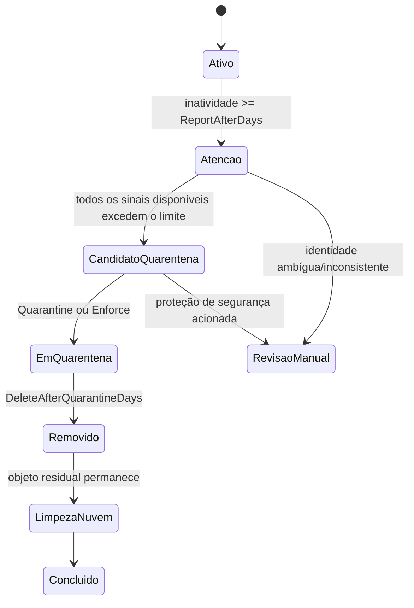

# DeviceLifecycle

[English](README.md) | [Português](README.pt-BR.md)

[](LICENSE)

Automação em PowerShell para gerenciar com segurança o ciclo de vida de dispositivos Windows entre Active Directory, Microsoft Entra ID e Microsoft Intune.

> **Estado atual:** validado em produção com `ReportOnly`, simulação `Enforce -WhatIf` e execução controlada em `Enforce`.

## Visão geral

Dispositivos Windows podem permanecer registrados por muito tempo no Active Directory, Entra ID e Intune depois de deixarem de ser utilizados. Esses registros nem sempre existem ou são atualizados ao mesmo tempo, portanto uma política segura de ciclo de vida não pode depender apenas do nome do computador nem exigir que todas as fontes estejam presentes.

O DeviceLifecycle usa o Active Directory como fonte local autoritativa, correlaciona registros cloud quando eles existem e avalia somente os sinais de atividade realmente disponíveis e confiáveis.

O fluxo possui três modos:

- `ReportOnly`: inventaria, classifica e gera evidências sem alterações administrativas;
- `Quarantine`: executa contenção reversível e preserva o estado do ciclo de vida;
- `Enforce`: inclui quarentena e permite remoção definitiva depois dos períodos configurados de retenção.

## Política de correlação atual

A política de decisão distingue **fonte ausente** de **fonte inconsistente**.

1. O objeto do Active Directory é sempre necessário e seu timestamp de atividade é obrigatório.
2. Se existir exatamente um dispositivo correspondente no Entra ID, ele participa da decisão e seu timestamp de atividade deve ser válido.
3. Se existir exatamente um registro correspondente no Intune, ele também participa da decisão e seu timestamp deve ser válido.
4. Se não existir registro no Entra ID ou Intune, essa fonte é tratada como evidência indisponível e não bloqueia o ciclo de vida.
5. Se houver múltiplas correspondências, inconsistência de identidade ou timestamp ausente em uma fonte que existe, o dispositivo vai para `ManualReview`.
6. Uma falha de consulta ao Graph é tratada de forma diferente de uma resposta válida com zero registros e mantém o comportamento fail-closed.

Exemplos:

| Evidência disponível | Resultado da avaliação |
|---|---|
| AD antigo; Entra ausente; Intune ausente | Usa somente o AD |
| AD antigo; Entra antigo; Intune ausente | Usa AD + Entra |
| AD antigo; Entra antigo; Intune antigo | Usa as três fontes |
| AD antigo; Entra recente | Permanece ativo |
| AD antigo; Intune recente | Permanece ativo |
| Fonte existente sem timestamp confiável | `ManualReview` |
| Correspondência duplicada ou inconsistente | `ManualReview` |

Essa política evita manter computadores antigos indefinidamente em revisão manual apenas porque um registro cloud não existe, sem enfraquecer as validações quando a fonte está presente.

## Ciclo de vida



Padrões atuais:

| Etapa | Padrão |
|---|---:|
| Entrada no relatório de atenção | 75 dias sem atividade |
| Candidato à quarentena | 90 dias sem atividade |
| Exclusão definitiva | 30 dias adicionais em quarentena |
| Limpeza residual no Entra | 7 dias após exclusão no AD |

## Modelo de execução agendada

O instalador registra **duas tarefas separadas**.

### `{OrganizationName} - Device Lifecycle`

Tarefa principal do ciclo de vida.

- executa diariamente no horário definido em `TaskTime`;
- usa o modo configurado em `Mode` (`ReportOnly`, `Quarantine` ou `Enforce`);
- pode alterar AD, Intune e Entra conforme a etapa e as proteções aplicáveis;
- roda como `NT AUTHORITY\SYSTEM`.

### `{OrganizationName} - Device Lifecycle Snapshot`

Tarefa de observabilidade e inventário.

- executa em intervalo definido por `SnapshotIntervalMinutes`;
- o padrão é 30 minutos;
- força `-ModeOverride ReportOnly` independentemente do modo operacional principal;
- mantém `DeviceLifecycle-Latest.csv` atualizado para auditoria, dashboards e integrações;
- nunca executa ações de lifecycle.

As duas tarefas usam `Invoke-DeviceLifecycleLocked.ps1`, evitando execuções concorrentes do mesmo processo.

## Segurança

O projeto mantém controles de segurança explícitos:

- `ReportOnly` continua sendo o modo padrão de implantação;
- ausência de registro cloud não é tratada como inconsistência;
- correspondências duplicadas, ambíguas ou incompatíveis permanecem em `ManualReview`;
- timestamps vazios em fontes existentes permanecem em `ManualReview`;
- objetos protegidos e exceções configuradas não são alterados;
- `MaximumActionsPerRun` limita o impacto operacional por execução;
- caminhos destrutivos suportam PowerShell `-WhatIf`;
- a exclusão final ocorre somente após a janela de quarentena;
- a limpeza residual no Entra ocorre somente após a exclusão do objeto no AD;
- o estado persistente permite continuar o lifecycle mesmo depois que um `Retire` remove o registro do Intune.

Consulte [SECURITY.md](SECURITY.md) e [Arquitetura](docs/pt-BR/ARCHITECTURE.md).

## Requisitos

- Windows Server com Windows PowerShell 5.1;
- módulo PowerShell do Active Directory;
- módulos Microsoft Graph usados pelo projeto;
- App Registration no Microsoft Entra com autenticação por certificado;
- permissões administrativas delegadas somente no escopo necessário;
- OU de quarentena dentro do escopo de sincronização do Microsoft Entra Connect quando o ambiente utilizar Hybrid Join.

Permissões de aplicação usadas pelo projeto:

- `Device.ReadWrite.All`
- `DeviceManagementManagedDevices.ReadWrite.All`
- `DeviceManagementManagedDevices.PrivilegedOperations.All`
- `DeviceManagementServiceConfig.Read.All`

## Início rápido

### 1. Configurar

Edite `DeviceLifecycle.Config.psd1`:

```powershell
OrganizationName = 'orgname'
Mode = 'ReportOnly'

TenantId = 'SEU-TENANT-ID'
ClientId = 'SEU-CLIENT-ID'
CertificateThumbprint = 'THUMBPRINT-DO-CERTIFICADO-LOCAL-MACHINE'
```

### 2. Inicializar

```powershell
.\Initialize-DeviceLifecycle.ps1 `
    -InstallModules `
    -CreateAdObjects `
    -CreateCertificate
```

### 3. Validar o ambiente

```powershell
.\Test-DeviceLifecycle.ps1
```

### 4. Executar o inventário inicial

```powershell
.\Invoke-DeviceLifecycle.ps1 -ModeOverride ReportOnly
```

Revise principalmente:

- `ManualReview`
- `AmbiguousEntraMatch`
- `AmbiguousIntuneMatch`
- `MissingActivityTimestamp`
- `Warning`
- `QuarantineCandidate`

### 5. Instalar as tarefas

```powershell
.\Install-DeviceLifecycleTask.ps1
```

Em uma instalação já existente, o instalador preserva a configuração operacional por padrão. Use `-ForceConfig` somente quando quiser substituir deliberadamente o arquivo instalado pelo template fornecido ao instalador.

## Ativação de Enforce

A sequência recomendada antes de produção é:

```powershell
.\Invoke-DeviceLifecycle.ps1 -ModeOverride ReportOnly
.\Invoke-DeviceLifecycle.ps1 -ModeOverride Enforce -WhatIf
.\Invoke-DeviceLifecycle.ps1 -ModeOverride Enforce
```

Depois de revisar o primeiro lote alterado e confirmar o comportamento esperado, configure:

```powershell
Mode = 'Enforce'
```

A tarefa principal passa a executar o lifecycle completo no horário configurado, enquanto a tarefa de snapshot continua isolada em `ReportOnly`.

### Validação de produção

Em 28 de agosto de 2026, a política de correlação opcional de Entra ID/Intune foi validada em ambiente real. O snapshot `ReportOnly` classificou corretamente dispositivos antigos sem registros cloud como candidatos ao lifecycle, `Enforce -WhatIf` apresentou apenas as ações esperadas e a primeira execução controlada em `Enforce` concluiu a quarentena do lote permitido sem depender da existência de registros no Entra ID ou Intune.

Os detalhes quantitativos e identificadores do ambiente não são versionados no repositório público.

## Recuperação

Simular:

```powershell
.\Restore-QuarantinedDevice.ps1 -ComputerName NOME-DO-DISPOSITIVO -WhatIf
```

Executar:

```powershell
.\Restore-QuarantinedDevice.ps1 -ComputerName NOME-DO-DISPOSITIVO
```

Um `Retire` concluído no Intune pode exigir novo enrollment após a restauração.

## DeviceLifecycle-API

O [DeviceLifecycle-API](https://github.com/diogowermann/DeviceLifecycle-API) é uma extensão separada, opcional e somente leitura. Ela publica os relatórios e logs gerados pelo DeviceLifecycle para consumidores autorizados, sem possuir endpoints de quarentena, exclusão ou restauração.

## Estrutura principal

```text
DeviceLifecycle/
|-- CHANGELOG.md
|-- DeviceLifecycle.Config.psd1
|-- DeviceLifecycle.Helpers.psm1
|-- Initialize-DeviceLifecycle.ps1
|-- Install-DeviceLifecycleTask.ps1
|-- Invoke-DeviceLifecycle.ps1
|-- Invoke-DeviceLifecycleLocked.ps1
|-- Restore-QuarantinedDevice.ps1
|-- Test-DeviceLifecycle.ps1
|-- Uninstall-DeviceLifecycle.ps1
|-- SECURITY.md
|-- tests/
|   `-- Test-ActivityCorrelationPolicy.ps1
|-- docs/
|   |-- en/ARCHITECTURE.md
|   `-- pt-BR/ARCHITECTURE.md
|-- README.md
`-- README.pt-BR.md
```

## Documentação

- [Arquitetura e decisões de engenharia](docs/pt-BR/ARCHITECTURE.md)
- [Política de segurança](SECURITY.md)
- [Histórico de alterações](CHANGELOG.md)
- [English documentation](README.md)
- [DeviceLifecycle-API](https://github.com/diogowermann/DeviceLifecycle-API)

## Licença

O DeviceLifecycle é distribuído sob a [Licença MIT](LICENSE).

## Autor

Desenvolvido por [Diogo Wermann](https://github.com/diogowermann) como parte de um portfólio de gerenciamento de endpoints Windows, identidade e automação.
