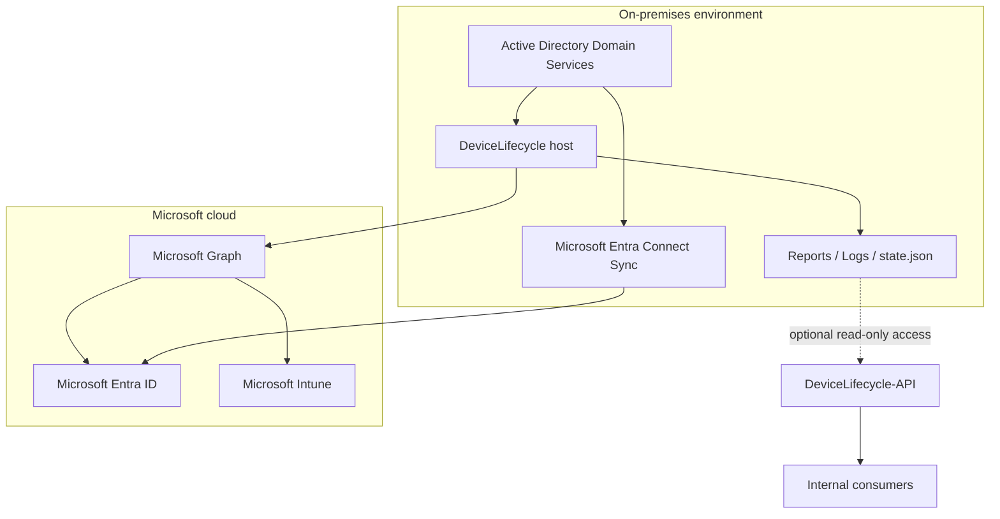
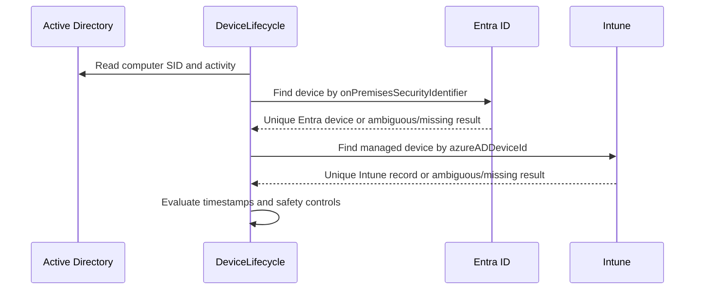
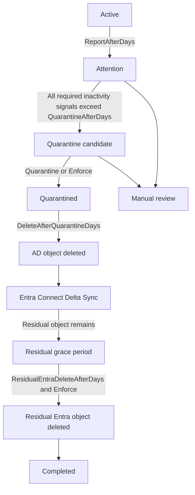
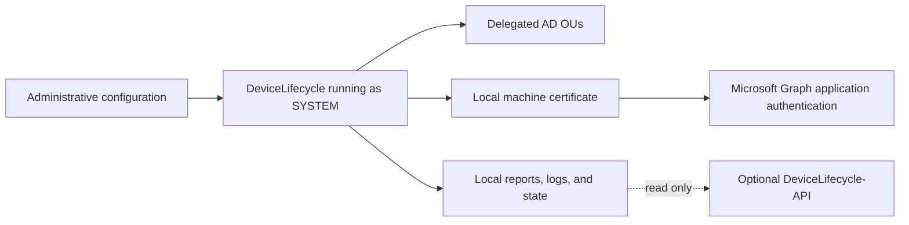

# DeviceLifecycle Architecture

[English](ARCHITECTURE.md) | [Português](../pt-BR/ARCHITECTURE.md)

## Purpose

DeviceLifecycle automates the lifecycle of inactive hybrid Windows devices while minimizing the risk of deleting the wrong identity. It treats Active Directory as the authoritative on-premises source, correlates the corresponding Microsoft Entra ID and Intune records, and applies changes only when the correlation and activity evidence are sufficiently reliable.

## System Context

<!-- IMAGE PLACEHOLDER: Add a sanitized diagram showing the real deployment topology here. Suggested path: ../assets/deployment-topology.png -->

## Source Responsibilities

| Source | Responsibility |
|---|---|
| Active Directory | Authoritative on-premises computer account, SID, enabled state, OU placement, and domain activity signals |
| Microsoft Entra ID | Hybrid cloud device identity and cloud activity information |
| Microsoft Intune | Managed-device identity, management state, and Intune activity information |
| `state.json` | Persistent lifecycle context that survives removal of an Intune managed-device record |
| CSV reports | Human-readable execution outcome and manual-review queue |
| Logs | Operational trace for diagnosis and audit |

## Identity Correlation

The automation avoids matching devices by display name alone.

1. The AD computer SID is matched against `onPremisesSecurityIdentifier` in Microsoft Entra ID.
2. The Entra `deviceId` is matched against `azureADDeviceId` in Intune.
3. When a cloud record exists, the result must be unique and satisfy the identity-consistency checks. A missing cloud record is treated as unavailable evidence rather than a correlation failure.

A missing cloud record is not guessed or synthesized; that source is omitted from the activity decision. Duplicated, ambiguous, or inconsistent matches are classified for manual review.

## Lifecycle State Model

The operational lifecycle is controlled by configurable thresholds.

### ReportOnly

- Reads inventory and activity signals.
- Produces reports and logs.
- Does not modify AD, Entra ID, or Intune.
- Is the default and recommended initial deployment mode.

### Quarantine

- Executes Intune `Retire` when a valid Intune record exists.
- Disables the AD computer account.
- Moves the AD object into the configured quarantine OU.
- Stores identifiers and timestamps in persistent state.
- Does not perform final deletion.

### Enforce

- Includes quarantine behavior.
- Deletes AD computer objects after the quarantine retention period.
- Removes residual Intune records when applicable.
- Starts Entra Connect Delta Sync when configured.
- Removes a residual Entra object only after the configured post-AD-deletion grace period.

## Trust Boundaries

The primary trust boundaries are:

- the delegated AD scope;
- the certificate private key stored on the execution server;
- Microsoft Graph application permissions;
- write access to the configuration and installation directories;
- access to reports and logs, which may contain internal device metadata.

## Engineering Decisions

### Stable identifiers over names

Computer names can be reused, renamed, duplicated in stale records, or represented inconsistently. SID and GUID-based correlation reduces false matches.

### Conservative failure behavior

Uncertainty results in `ManualReview`, not a destructive fallback. This includes duplicate or inconsistent matches, missing activity timestamps for sources that exist, protected objects, and unsupported records. A source with no correlated record is treated as unavailable evidence and does not block lifecycle evaluation from the remaining sources.

### Persistent state after Retire

An Intune `Retire` can remove the managed-device record before the quarantine period ends. The local state file preserves the identity and quarantine timeline so the workflow can continue deterministically.

### Quarantine before deletion

The quarantine stage creates a recovery window. The device is disabled and isolated operationally before permanent deletion occurs.

### Bounded execution

`MaximumActionsPerRun` limits the blast radius of an incorrect configuration, unexpected API response, or data-quality issue.

### Least privilege

The scheduled task runs as `SYSTEM`, which uses the server computer account against AD. Delegation should be restricted to the active-computers and quarantine OUs. Domain Admin membership is neither required nor recommended.

### Separate observability extension

DeviceLifecycle-API is kept in a separate repository and exposes only generated files. It has no lifecycle write endpoints and is not required by the main automation.

## Entra Connect Scope Requirement

The quarantine OU must remain in Microsoft Entra Connect synchronization scope. If it is excluded, moving a computer into quarantine may cause immediate removal from Entra ID, bypassing the intended grace period.

This should be validated before enabling `Quarantine` or `Enforce`.

## Recovery Model

Recovery is intentionally explicit rather than automatic. It may require:

1. re-enabling the AD computer account;
2. moving it back to the active-computers OU;
3. clearing the configured state attribute;
4. updating persistent state if necessary;
5. starting Delta Sync;
6. validating hybrid join and Intune enrollment.

Use `Restore-QuarantinedDevice.ps1` with `-WhatIf` first.

## Failure Handling

The system favors preserving the last known safe state:

- Graph or Autopilot lookup failures prevent unsafe destructive actions where membership cannot be established.
- Ambiguous identities remain unchanged.
- Protected AD objects remain unchanged.
- Action limits stop further changes in the same run.
- Logs and CSV reports record the classification and reason.

<!-- IMAGE PLACEHOLDER: Add a sanitized log excerpt demonstrating safe failure behavior here. Suggested path: ../assets/safe-failure-log.png -->

## Security Considerations

- Protect the certificate private key and restrict local administrator access.
- Do not version tenant-specific IDs, production thumbprints, internal hostnames, or real device reports in public branches.
- Delegate only the AD permissions required by the configured lifecycle operations.
- Keep the default mode as `ReportOnly` during initial deployment and after major configuration changes.
- Validate BitLocker recovery-key availability before enabling final enforcement.
- Back up operational reports and logs before uninstalling.
- Treat CSV reports and logs as internal operational data.

## Related Documentation

- [Main README](../../README.md)
- [Portuguese README](../../README.pt-BR.md)
- [DeviceLifecycle-API](https://github.com/diogowermann/DeviceLifecycle-API)
