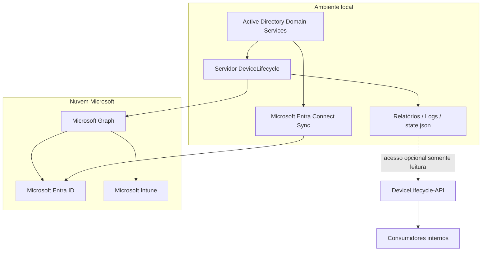
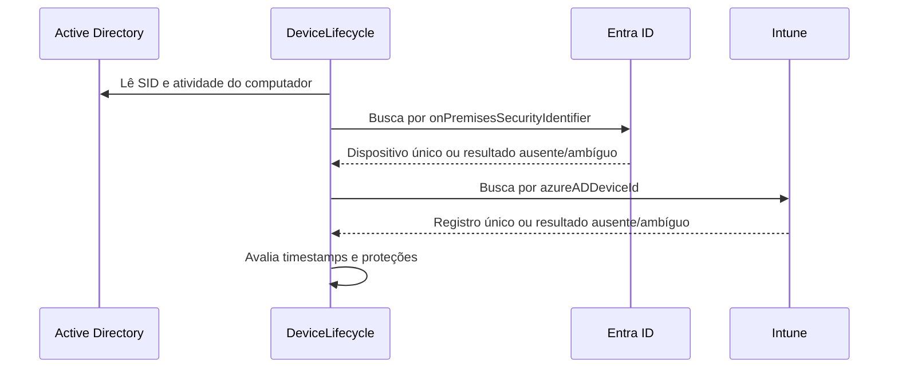
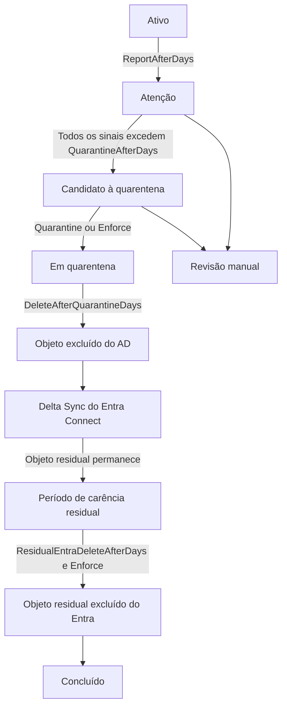
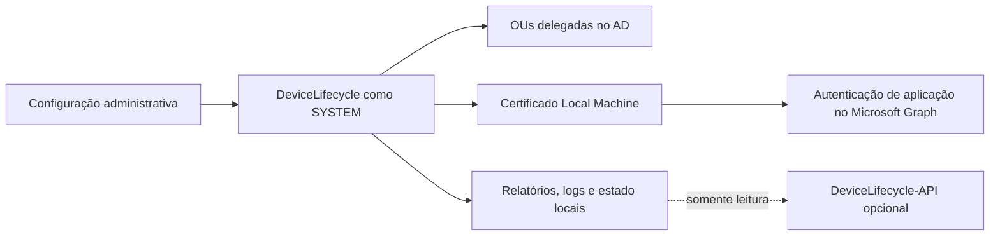

# Arquitetura do DeviceLifecycle

[English](../en/ARCHITECTURE.md) | [Português](ARCHITECTURE.md)

## Objetivo

O DeviceLifecycle automatiza o ciclo de vida de dispositivos Windows híbridos inativos, reduzindo o risco de excluir a identidade incorreta. O Active Directory é tratado como fonte autoritativa local; os registros correspondentes no Microsoft Entra ID e no Intune são correlacionados antes de qualquer alteração.

## Contexto do sistema

<!-- IMAGE PLACEHOLDER: Adicionar aqui um diagrama sanitizado da topologia real de implantação. Caminho sugerido: ../assets/deployment-topology.png -->

## Responsabilidade de cada fonte

| Fonte | Responsabilidade |
|---|---|
| Active Directory | Conta local do computador, SID, estado habilitado, OU e sinais de atividade do domínio |
| Microsoft Entra ID | Identidade híbrida na nuvem e informações de atividade |
| Microsoft Intune | Identidade gerenciada, estado de gerenciamento e atividade no Intune |
| `state.json` | Contexto persistente que sobrevive à remoção do registro gerenciado pelo Intune |
| Relatórios CSV | Resultado legível da execução e fila de revisão manual |
| Logs | Rastro operacional para diagnóstico e auditoria |

## Correlação de identidade

A automação não depende apenas do nome do computador.

1. O SID do computador no AD é comparado com `onPremisesSecurityIdentifier` no Entra ID.
2. O `deviceId` do Entra é comparado com `azureADDeviceId` no Intune.
3. O resultado deve ser único e cumprir os requisitos configurados.

Uma correspondência ausente ou duplicada não é adivinhada. O registro é classificado para revisão manual.

## Modelo de ciclo de vida

### ReportOnly

- Lê inventário e sinais de atividade.
- Gera relatórios e logs.
- Não altera AD, Entra ID ou Intune.
- É o modo padrão e recomendado para implantação inicial.

### Quarantine

- Executa `Retire` no Intune quando existe correspondência válida.
- Desabilita a conta do computador no AD.
- Move o objeto para a OU de quarentena.
- Preserva identificadores e timestamps em estado persistente.
- Não executa exclusão definitiva.

### Enforce

- Inclui o comportamento de quarentena.
- Exclui objetos do AD após o período configurado.
- Remove registros residuais do Intune quando aplicável.
- Inicia Delta Sync quando configurado.
- Exclui objeto residual do Entra apenas após o período posterior à exclusão no AD.

## Limites de confiança

Os principais limites de confiança são:

- escopo delegado no AD;
- chave privada do certificado no servidor de execução;
- permissões de aplicação no Microsoft Graph;
- acesso de gravação aos diretórios de configuração e instalação;
- acesso aos relatórios e logs, que podem conter metadados internos.

## Decisões de engenharia

### Identificadores estáveis em vez de nomes

Nomes podem ser reutilizados, alterados ou permanecer duplicados em registros antigos. A correlação por SID e GUID reduz correspondências incorretas.

### Falha conservadora

Incerteza resulta em `ManualReview`, não em ação destrutiva. Isso inclui registros ausentes, duplicados, timestamps vazios, objetos protegidos e situações não suportadas.

### Estado persistente após Retire

O `Retire` pode remover o registro gerenciado antes do fim da quarentena. O arquivo de estado preserva identidade e datas para que o fluxo continue de forma determinística.

### Quarentena antes da exclusão

A quarentena cria uma janela de recuperação. O dispositivo é desabilitado e isolado antes da remoção permanente.

### Execução limitada

`MaximumActionsPerRun` reduz o impacto de uma configuração incorreta, resposta inesperada da API ou problema de qualidade dos dados.

### Menor privilégio

A tarefa é executada como `SYSTEM` e usa a conta de computador do servidor contra o AD. A delegação deve ficar restrita às OUs necessárias. Domain Admin não é necessário nem recomendado.

### Extensão de observabilidade separada

O DeviceLifecycle-API fica em outro repositório, expõe apenas arquivos gerados e não possui endpoints de alteração do ciclo de vida.

## Requisito de escopo do Entra Connect

A OU de quarentena deve permanecer no escopo de sincronização. Se for excluída, mover um computador para a quarentena pode removê-lo imediatamente do Entra ID e eliminar o período de carência.

Valide esse ponto antes de habilitar `Quarantine` ou `Enforce`.

## Modelo de recuperação

A recuperação é explícita e pode exigir:

1. habilitar novamente a conta do computador no AD;
2. mover o objeto para a OU ativa;
3. limpar o atributo de estado configurado;
4. ajustar o estado persistente, se necessário;
5. iniciar Delta Sync;
6. validar Hybrid Join e enrollment no Intune.

Use primeiro `Restore-QuarantinedDevice.ps1` com `-WhatIf`.

## Tratamento de falhas

O sistema preserva o último estado conhecido como seguro:

- falhas na consulta ao Graph ou Autopilot bloqueiam ações destrutivas quando não é possível confirmar associação;
- identidades ambíguas não são alteradas;
- objetos protegidos no AD não são alterados;
- o limite de ações interrompe mudanças adicionais;
- logs e relatórios registram a classificação e o motivo.

<!-- IMAGE PLACEHOLDER: Adicionar aqui um trecho de log sanitizado demonstrando falha segura. Caminho sugerido: ../assets/safe-failure-log.png -->

## Considerações de segurança

- Proteja a chave privada do certificado e restrinja administradores locais.
- Não versione IDs reais do tenant, thumbprints de produção, hostnames internos ou relatórios reais em branches públicas.
- Delegue somente as permissões necessárias no AD.
- Mantenha `ReportOnly` durante a implantação inicial e após mudanças relevantes.
- Confirme a disponibilidade das chaves BitLocker antes do modo `Enforce`.
- Faça backup de relatórios e logs antes da desinstalação.
- Trate CSVs e logs como dados operacionais internos.

## Documentação relacionada

- [README principal](../../README.md)
- [README em português](../../README.pt-BR.md)
- [DeviceLifecycle-API](https://github.com/diogowermann/DeviceLifecycle-API)
